# ECE Devops Project

## Table of content

- [Description](#description)
- [Install](#install)
- [1. Create a Web Application](#1-create-a-web-application)
- [2. Apply CI/CD pipeline](#2-apply-cicd-pipeline)
  - [CI](#ci)
    - [The steps](#the-steps)
    - [Multiple OS support](#multiple-os-support)
    - [Choice justification](#choice-justification)
  - [CD](#cd)
    - [The setup](#the-setup)
    - [Code adaption](#code-adaption)
    - [The pipeline](#the-pipeline)
    - [Pipeline duration Optimization](#pipeline-duration-optimization)
    - [Access the User API on Azure](#access-the-user-api-on-azure)
- [3. Configuring and provisioning a virtual environment and run our application using the IaC approach](#3-configuring-and-provisioning-a-virtual-environment-and-run-our-application-using-the-iac-approach)
  - [Alocating the Virtual Machine](#alocating-the-virtual-machine)
  - [Provisioning the Virtual Machine](#provisioning-the-virtual-machine)
  - [Usage](#usage)
  - [Demonstration](#demonstration)
  - [Destroy or stop the virtual machine](#destroy-or-stop-the-virtual-machine)
- [4. Building Docker image of our application](#4-building-docker-image-of-our-application)
- [5. Making container orchestration using Docker Compose](#5-making-container-orchestration-using-docker-compose)
- [6. Making docker orchestration using Kubernetes](#6-making-docker-orchestration-using-kubernetes)
- [7. Making a service mesh using Istio](#7-making-a-service-mesh-using-istio)
- [8. Implementing Monitoring to our containerized application](#8-implementing-monitoring-to-our-containerized-application)


## Description

This is the repository for the Devops project at ECE Paris

Made by:

- Nathan DEPRAT [@Macbucheron1](https://github.com/Macbucheron1)
- Ibrahim Diallo [@Xeroxx75](https://github.com/Xeroxx75)

## Install

Follow this step to install the project localy:

1. Clone the repository:

    HTTP:
    ```bash
    git clone https://github.com/Macbucheron1/devops_project.git
    ```
    SSH:
    ```bash
    git clone git@github.com:Macbucheron1/devops_project.git
    ```


You are now ready to use the project.

## 1. Create a Web Application

Find all of the information in the [User API folder](./user_api/README.md). A link to come back to this page is available at the end of the README.

## 2. Apply CI/CD pipeline

### CI

CI stand for Continuous Integration. It is a practice in software engineering where the code is automatically tested and checked every time a developer pushes code to the repository. The goal is to find and address bugs and errors as soon as possible.

#### The steps

We have made our CI pipeline using Github Action. It is triggered on every push on the main branch. It run the following steps:

1. Check the code
2. Setup Redis
3. Check if Redis is running
4. Setup Node.js
5. Install dependencies
6. Run Linter to check the code

   > [!NOTE]
   > Linter is a tool that analyze the code to find errors and bugs. It also enforce a coding style. In our case we are using ESLint. You can find the configuration in the [.eslintrc.json](./user_api/.eslintrc.json) file.

7. Run the tests for the User API

Here is the result of a successful run:

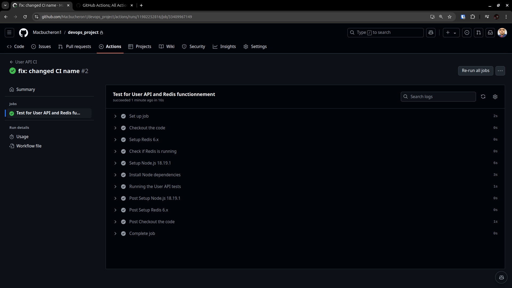

#### Multiple OS support

One of the Goal of the CI pipeline is to make sure that the code is working on mutiple platform and OS. Therefore, we have added a job to run the CI pipeline on MacOS and Windows. Here is the result of the CI pipeline on MacOS and Windows:

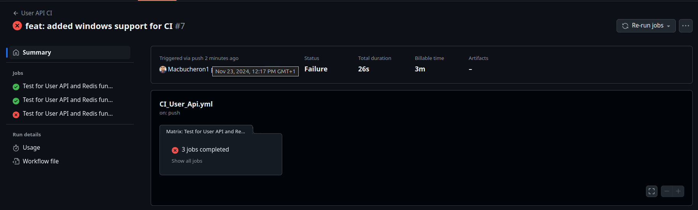

The job failed on Windows because we are using Redis. Redis is not available on Windows ! 

We have to remove the Windows job to have a successful run on all OS. Therefore our final CI pipeline is only running on MacOS and Linux.

Now here is the result of successful jobs on Linux and MacOS:

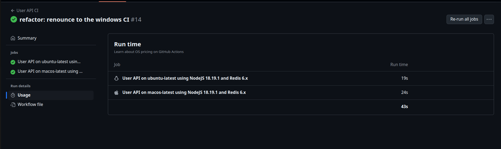

> [!TIP]
> We could have created a separeted job for the Windows runner and use a docker container with Redis to make it work. But we have decided to keep it simple for this project.

_For the next parts we also jobs for the different Node.js version_

#### Choice justification

_**Why did we install Redis instead of using a container?**_

We have chosen to install Redis in order to make it work on Linux AND MacOS. Indeed, [Docker container are not available only available on Linux](https://docs.github.com/en/actions/sharing-automations/creating-actions/about-custom-actions#types-of-actions). Therefore, we have to install Redis on the host machine in order to make it work on MacOS.

_**Why did we upload the user_api directory as an artifact instead of zipping all files in the repository and uploading it as the deployment artifact?** (As it was done in the [lab correction](https://github.com/adaltas/ece-devops-2024-fall/blob/main/modules/05.ci-cd/lab-corrections/master_user-api.yml))_

This choice was made for multiple reasons:

1. By uploading the `user_api` directory, we are only uploading the necessary files for the User API. This is more efficient than uploading the whole repository.
2. Using `user_api` allows the artifact to be easily consumed in Docker-based and non-Docker-based deployment scenarios.

In the lab correction, zipping the entire repository might have been simpler for a single deployment job focused on Azure Web App. However, in our case, the multi-job nature of the pipeline and the future integration of Docker-based deployment made the `user_api` directory a better choice.

### CD

#### The setup

> [!IMPORTANT]
> In order to make the api working online, we have use Azure Cache for Redis. To keep our project clean we have separated in the code for the [User API using local Redis](./user_api/README.md) from [User API for Azure](./user_api_Azure/README.md). We also added another workflow, separating the [CI pipeline using Redis Localy](./.github/workflows/CI_User_Api.yaml) from the [CI/CD pipeline for Azure](./.github/workflows/CI_CD_User_Api_Azure.yml) file. 

For the CD pipeline, we have decided to use Azure Web App. We have created a Web App and a Service Plan on Azure. We have also created a secret in the Github repository to store the Azure credentials. 

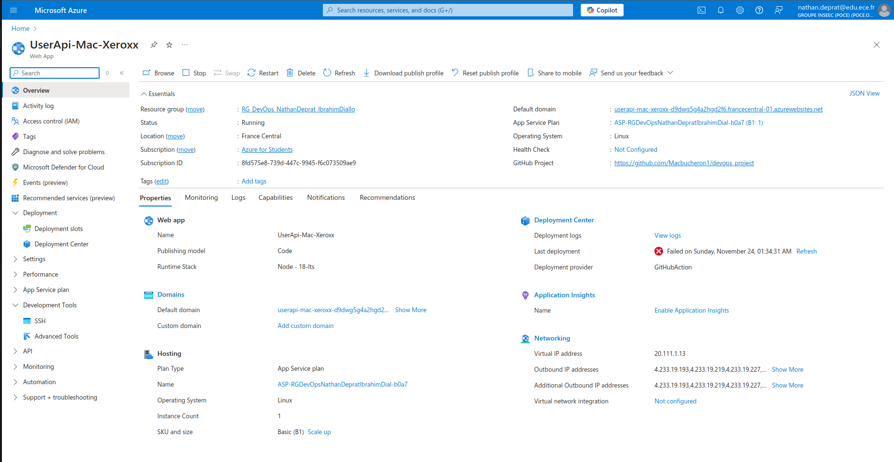

Furthermore, in order to be able to use the API online, we needed to have the Redis server running. We have decided to use the Azure Cache for Redis.

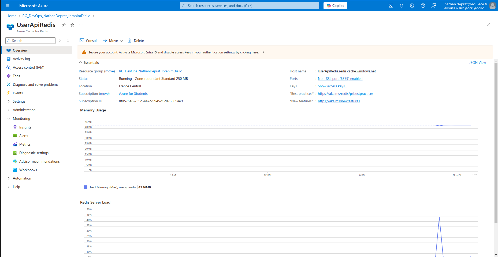

Here is the total Ressource Group we have created:

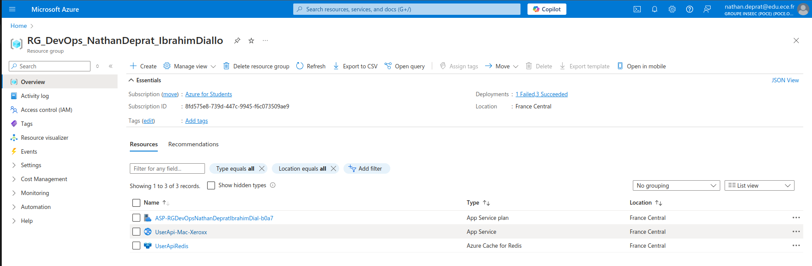

#### Code adaption

Since we are deploying the User API on Azure, we have to adapt the code to use the Azure Redis Cache. we simply change the connexion parameters in the [dbClient.js](./user_api/src/dbClient.js) file.

#### The pipeline

Finally, we have added to the CI pipeline a CD job. This job is triggered when the CI pipeline is successful. It will deploy the User API on Azure. You can see the result of the deployments in the [Actions tab](https://github.com/Macbucheron1/devops_project/actions) of the repository

Finally, after all the test and the deployment, we have a successful pipeline:

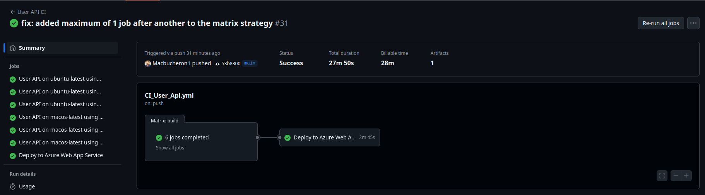

#### Pipeline duration Optimization

_**27m 50s ? Why so much time for a simple CRUD api ?**_

The pipeline is taking a long time to complete because we cannot use parallel jobs in our case. Since we are using Azure Cache for Redis, all the runner use the same database and not an independent redis server. Therefore, making parallel jobs would make the pipeline fail because of the database conflict.

_**How to otpimize our pipeline to reduce this duration**_

First of all, one of the longest step is the upload artifact for deployment. By looking at our Web App specification, we can see that it uses Node JS 18. And since the web server is running on ubuntu-latest, we can only upload the artifact on the ubuntu-latest & Node Js 18 runner.

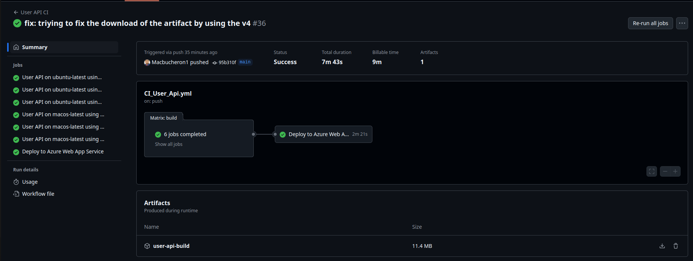

We can see that the CI/CD took much less time to complete.

Furtheremore we can also delete the installation of Redis. Indeed, since we are using Azure Cache for Redis, our API is only connecting to this online database. We can remove the Redis installation and the Redis check from the [CI pipeline](./.github/workflows/CI_CD_User_Api_Azure.yml).

#### Access the User API on Azure

You can access the User API on Azure **[Right here](https://https://userapi-mac-xeroxx-d9dwg5g4a2hgd2f6.francecentral-01.azurewebsites.net/)**


## 3. Configuring and provisioning a virtual environment and run our application using the IaC approach

The goal of this part is to create a virtual machine using the IaC approach. We have decided to use [Vagrant](https://www.vagrantup.com/) to create the virtual machine.
Then we will use [Ansible](https://www.ansible.com/) to provision the virtual machine and run our application.

### Alocating the Virtual Machine

We have created a [Vagrantfile](./InfrastructureAsCode/Vagrantfile) in the [InfrastructureAsCode](./InfrastructureAsCode/) directory. This file will create a virtual machine with the following specification:
- OS: [Ubuntu](https://portal.cloud.hashicorp.com/vagrant/discover/ubuntu/jammy64)
  > We chose Ubuntu, we wanted to change what we used in the previous labs in order to get better understanding of vagrant 
- RAM: 2048 MB
- CPU: 1
- Forwarded port: 3000 -> 3000
  > We are forwarding the port 3000 from the host machine to the virtual machine. This is the port where our User API is running. By doing this, we can access the User API from the host machine.

### Provisioning the Virtual Machine

We have created an [Ansible playbook](./InfrastructureAsCode/playbooks/run.yml) in the [playbooks](./InfrastructureAsCode/playbooks/) directory.
This playbook run the following roles/tasks:
- [Install](./InfrastructureAsCode/playbooks/roles/install/tasks/main.yml)
  - Update the package list
  - Install Node.js
  - Install npm
  - Install Redis
  - Install Node packages
- [Tests](./InfrastructureAsCode/playbooks/roles/tests/tasks/main.yml)
  - Check Redis is running
  - Run the User API Tests
  - Run lint tests

Finally, we provision the virtual machine using the following command to start the application:

```bash
echo "The VM is running"
cd /home/vagrant/user_api
npm start
```

### Usage

To use the virtual machine, you have to run the following command:

> [!Important]
> You will need to have [Vagrant](https://developer.hashicorp.com/vagrant/install) and [Virtual box](https://www.virtualbox.org/wiki/Downloads)installed on your machine to do this part. 

1. Move to the [InfrastructureAsCode](./InfrastructureAsCode/) directory:

    ```bash
    cd InfrastructureAsCode
    ```

2. Start the virtual machine:

    ```bash
    vagrant up
    ```

3. In your host machine, you can now access the User API at [http://localhost:3000](http://localhost:3000) or use `curl` to check that the API is running:
  
    ```bash
    curl http://localhost:3000/health
    ```

> [!CAUTION] 
> Sometimes you can get error when testing the API because of some process running on the port 3000. If you get an error, you can run the following command to kill the process: `kill -9 $(lsof -ti:3000)`
    
### Demonstration

Let's start the virtual machine:

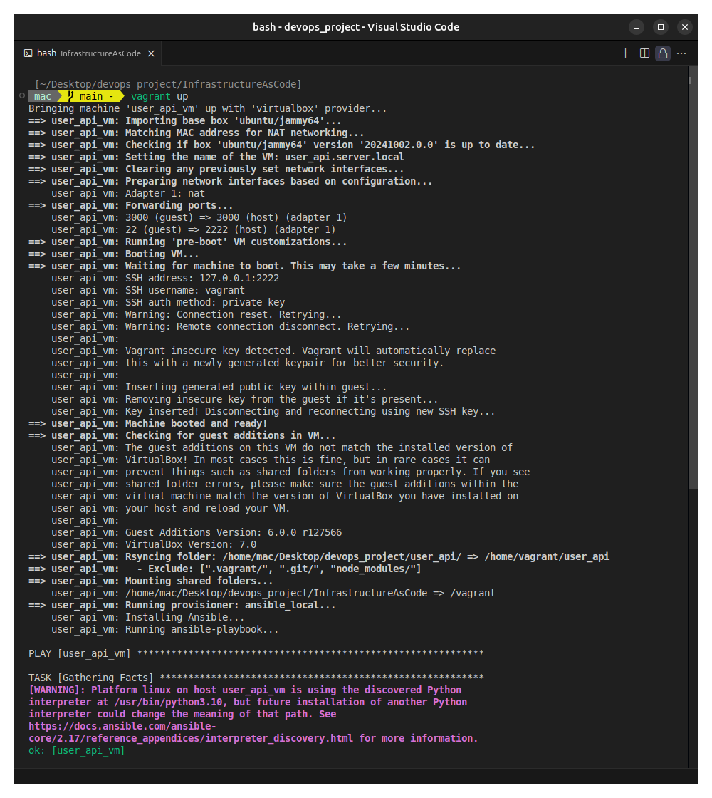
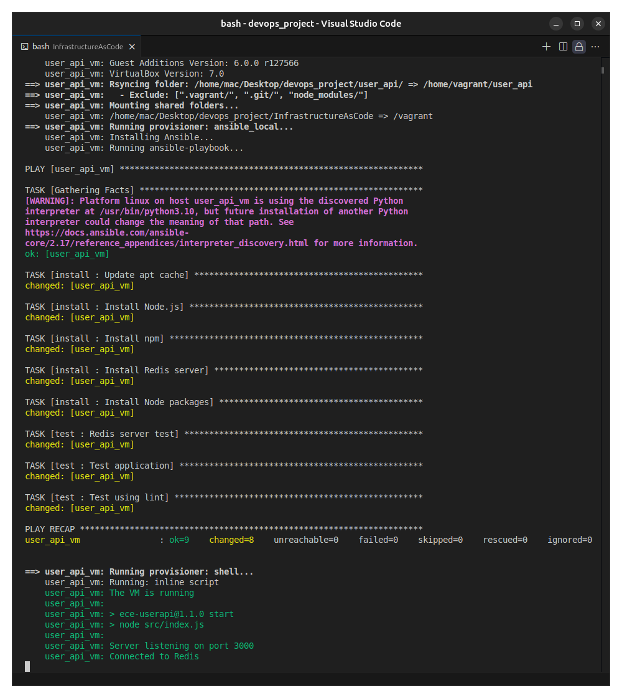

Great ! The virtual machine is running and all the test have pasted. Now let's check that the User API is running:

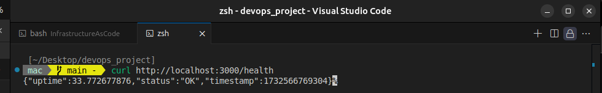

It is working smoothly.

### Destroy or stop the virtual machine

To stop the virtual machine, you can run the following command:

```bash
vagrant halt
```

To destroy the virtual machine, you can run the following command:

```bash
vagrant destroy
```


## 4. Building Docker image of our application

## 5. Making container orchestration using Docker Compose

## 6. Making docker orchestration using Kubernetes

## 7. Making a service mesh using Istio

## 8. Implementing Monitoring to our containerized application

## To ask

- Do you expect us the readme to be more like a walkthrough or a formal documentation ?

## To do