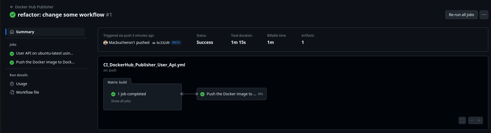
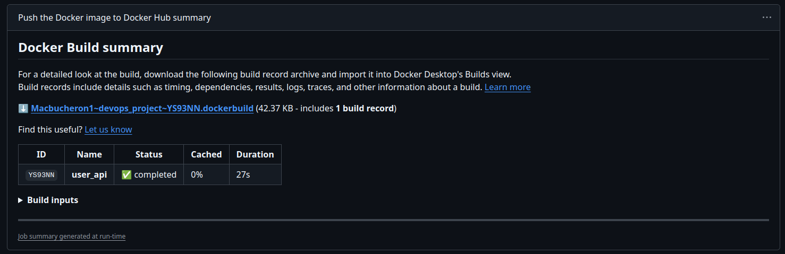
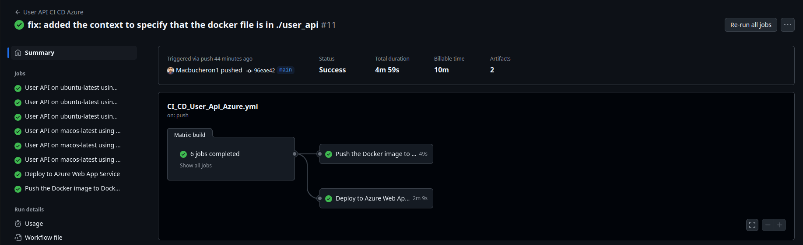
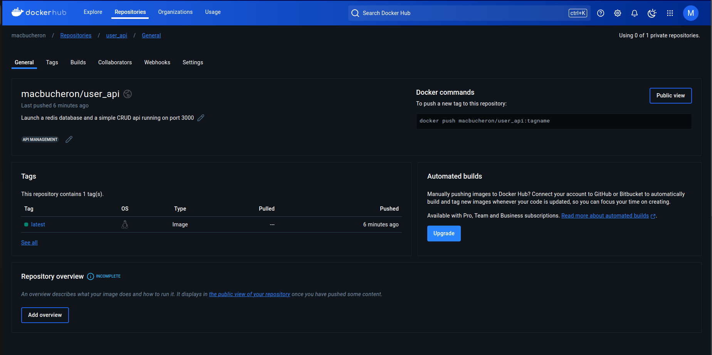
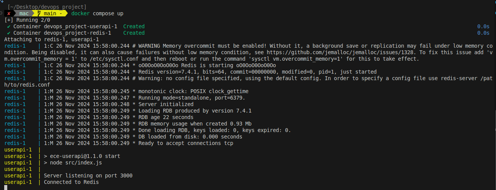
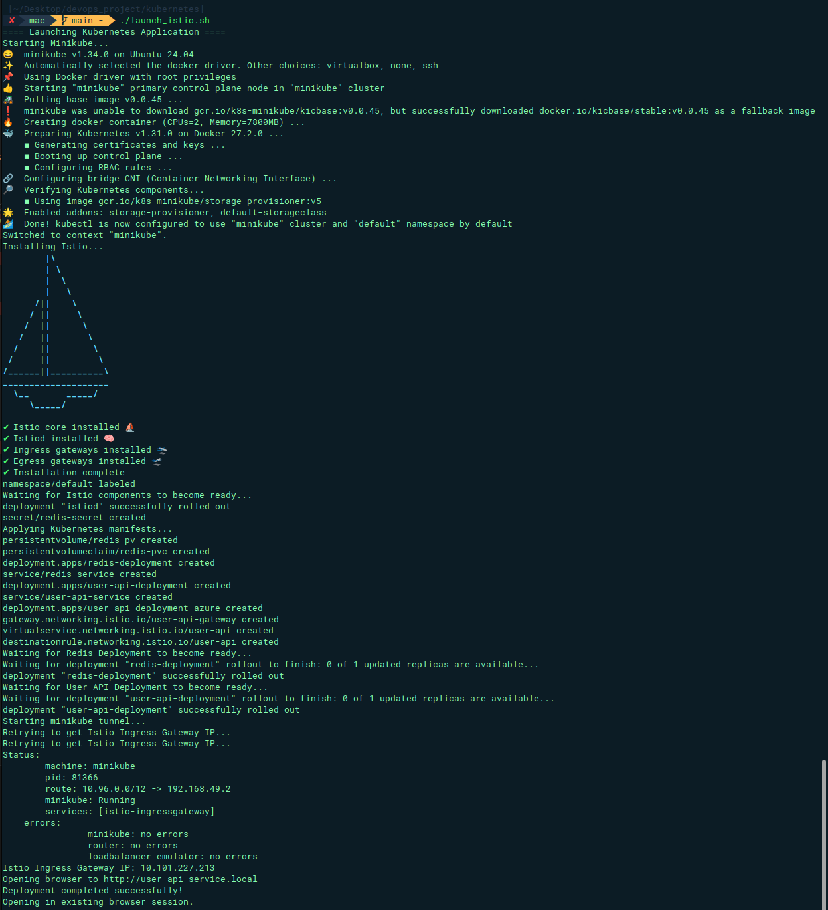
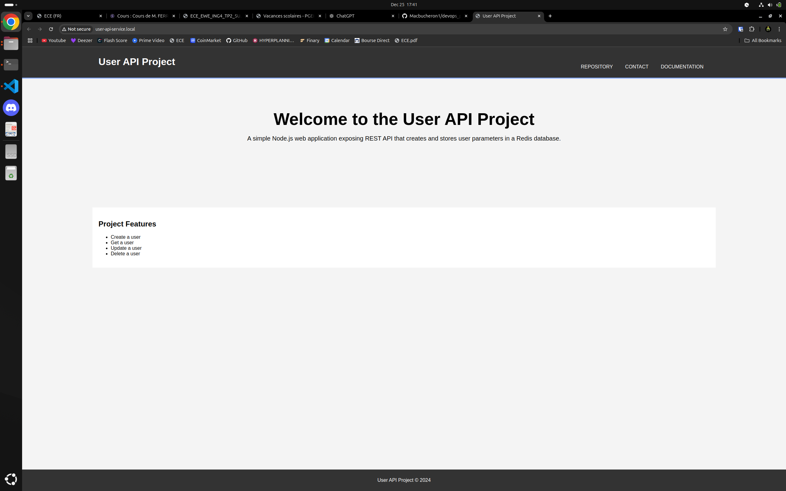

# ECE Devops Project

## Table of content

- [Description](#description)
- [Install](#install)
- [1. Create a Web Application](#1-create-a-web-application)
- [2. Apply CI/CD pipeline](#2-apply-cicd-pipeline)
  - [CI](#ci)
    - [The steps](#the-steps)
    - [Multiple OS support](#multiple-os-support)
    - [Choice justification](#choice-justification)
  - [CD](#cd)
    - [The setup](#the-setup)
    - [Code adaption](#code-adaption)
    - [The pipeline](#the-pipeline)
    - [Pipeline duration Optimization](#pipeline-duration-optimization)
    - [Access the User API on Azure](#access-the-user-api-on-azure)
- [3. Configuring and provisioning a virtual environment and run our application using the IaC approach](#3-configuring-and-provisioning-a-virtual-environment-and-run-our-application-using-the-iac-approach)
  - [Alocating the Virtual Machine](#alocating-the-virtual-machine)
  - [Provisioning the Virtual Machine](#provisioning-the-virtual-machine)
  - [Usage](#usage)
  - [Demonstration](#demonstration)
  - [Destroy or stop the virtual machine](#destroy-or-stop-the-virtual-machine)
- [4. Building Docker image of our application](#4-building-docker-image-of-our-application)
  - [Building the Docker image](#building-the-docker-image)
  - [Running the Docker image](#running-the-docker-image)
  - [Publishing the Docker image](#publishing-the-docker-image)
    - [Using Basic Docker push](#using-basic-docker-push)
    - [Using Github Actions](#using-github-actions)
- [5. Making container orchestration using Docker Compose](#5-making-container-orchestration-using-docker-compose)
- [6. Making docker orchestration using Kubernetes](#6-making-docker-orchestration-using-kubernetes)
  - [Prerequisites](#prerequisites)
  - [Deploying](#1-deploying)
    - [user-api deployment.yaml](#user-api-deploymentyaml)
    - [redis deployment.yaml](#redis-deploymentyaml)
  - [Exposing the service](#2-exposing-the-service)
  - [Use persistent storage](#3-use-persistent-storage)
  - [Usage](#4-usage)
  - [Delete](#5-delete)
- [7. Making a service mesh using Istio](#7-making-a-service-mesh-using-istio)
  - [Deploy the application using istio](#deploy-the-application-using-istio)
  - [Route request and trafic shifting](#route-request-and-trafic-shifting)
  - [Demonstration](#istio-demonstration)

## Description

This is the repository for the Devops project at ECE Paris

Made by:

- Nathan DEPRAT [@Macbucheron1](https://github.com/Macbucheron1)
- Ibrahim Diallo [@Xeroxx75](https://github.com/Xeroxx75)

## Install

Follow this step to install the project localy:

1. Clone the repository:

   HTTP:

   ```bash
   git clone https://github.com/Macbucheron1/devops_project.git
   ```

   SSH:

   ```bash
   git clone git@github.com:Macbucheron1/devops_project.git
   ```

You are now ready to use the project.

## 1. Create a Web Application

> [!Important]
> Find all of the information in the [User API folder](./user_api/README.md). A link to come back to this page is available at the end of the README.

The goal of this section is to create an API and to cover it with test. 
Since the project is more about devops tools than the code itself, we have decided to keep this part simple and simply use the API made during [Lab 4](https://github.com/adaltas/ece-devops-2024-fall/blob/main/modules/04.continuous-testing/lab.md)

The API is a simple CRUD API that manage users. It is made with Node.js and Express. We are using Redis as a database.
We have made some test for the API using [Mocha](https://mochajs.org/) and [Chai](https://www.chaijs.com/).

| Subject                                                         |   Code    | Max. grade| Done |
|:----------------------------------------------------------------|:---------:|:---------:| ---- |
| Enriched web application with automated tests                   |   APP     |    +2     |  ✅  |
| **Bonus**                                                       |           |           |      |
| Swagger Integration                                             |           |           |  ✅  |

## 2. Apply CI/CD pipeline

### CI
CI stand for Continuous Integration. It is a practice in software engineering where the code is automatically tested and checked every time a developer pushes code to the repository. The goal is to find and address bugs and errors as soon as possible.

#### The steps

We have made our CI pipeline using Github Action. It is triggered on every push on the main branch. It run the following steps:

1. Check the code
2. Setup Redis
3. Check if Redis is running
4. Setup Node.js
5. Install dependencies
6. Run Linter to check the code

> [!NOTE]
> Linter is a tool that analyze the code to find errors and bugs. It also enforce a coding style. In our case we are using ESLint. You can find the configuration in the [.eslintrc.json](./user_api/.eslintrc.json) file.

7. Run the tests for the User API

Here is the result of a successful run:


#### Multiple OS support

One of the Goal of the CI pipeline is to make sure that the code is working on mutiple platform and OS. Therefore, we have added a job to run the CI pipeline on MacOS and Windows. Here is the result of the CI pipeline on MacOS and Windows:


The job failed on Windows because we are using Redis. Redis is not available on Windows !

We have to remove the Windows job to have a successful run on all OS. Therefore our final CI pipeline is only running on MacOS and Linux.

Now here is the result of successful jobs on Linux and MacOS:


> [!TIP]
> We could have created a separeted job for the Windows runner and use a docker container with Redis to make it work. But we have decided to keep it simple for this project.

_For the next parts we also added jobs for the different Node.js version_

#### Choice justification

_**Why did we install Redis instead of using a container?**_

We have chosen to install Redis in order to make it work on Linux AND MacOS. Indeed, [Docker container are not available only available on Linux](https://docs.github.com/en/actions/sharing-automations/creating-actions/about-custom-actions#types-of-actions). Therefore, we have to install Redis on the host machine in order to make it work on MacOS.

_**Why did we upload the user_api directory as an artifact instead of zipping all files in the repository and uploading it as the deployment artifact?** (As it was done in the [lab correction](https://github.com/adaltas/ece-devops-2024-fall/blob/main/modules/05.ci-cd/lab-corrections/master_user-api.yml))_

This choice was made for multiple reasons:

1. By uploading the `user_api` directory, we are only uploading the necessary files for the User API. This is more efficient than uploading the whole repository.
2. Using `user_api` allows the artifact to be easily consumed in Docker-based and non-Docker-based deployment scenarios.

In the lab correction, zipping the entire repository might have been simpler for a single deployment job focused on Azure Web App. However, in our case, the multi-job nature of the pipeline and the future integration of Docker-based deployment made the `user_api` directory a better choice.

### CD

#### The setup

> [!IMPORTANT]
> In order to make the api working online, we have use Azure Cache for Redis. To keep our project clean we have separated the code for the [User API using local Redis](./user_api/README.md) from the code for the [User API for Azure](./user_api_Azure/README.md). We also added another workflow, separating the [CI pipeline using Redis Localy](./.github/workflows/CI_User_Api.yaml) from the [CI/CD pipeline for Azure](./.github/workflows/CI_CD_User_Api_Azure.yml) file.

For the CD pipeline, we have decided to use Azure Web App. We have created a Web App and a Service Plan on Azure. We have also created a secret in the Github repository to store the Azure credentials.


Furthermore, in order to be able to use the API online, we needed to have the Redis server running. We have decided to use the Azure Cache for Redis.


Here is the total Ressource Group we have created:


#### Code adaption

Since we are deploying the User API on Azure, we have to adapt the code to use the Azure Redis Cache. we simply change the connexion parameters in the [dbClient.js](./user_api/src/dbClient.js) file.

#### The pipeline

Finally, we have added to the CI pipeline a CD job. This job is triggered when the CI pipeline is successful. It will deploy the User API on Azure. You can see the result of the deployments in the [Actions tab](https://github.com/Macbucheron1/devops_project/actions) of the repository

Finally, after all the test and the deployment, we have a successful pipeline:


#### Pipeline duration Optimization

_**27m 50s ? Why so much time for a simple CRUD api ?**_

The pipeline is taking a long time to complete because we cannot use parallel jobs in our case. Since we are using Azure Cache for Redis, all the runner use the same database and not an independent redis server. Therefore, making parallel jobs would make the pipeline fail because of the database conflict.

_**How to otpimize our pipeline to reduce this duration**_

First of all, one of the longest step is the upload artifact for deployment. By looking at our Web App specification, we can see that it uses Node JS 18. And since the web server is running on ubuntu-latest, we can only upload the artifact on the ubuntu-latest & Node Js 18 runner.


We can see that the CI/CD took much less time to complete.

Furtheremore we can also delete the installation of Redis. Indeed, since we are using Azure Cache for Redis, our API is only connecting to this online database. We can remove the Redis installation and the Redis check from the [CI pipeline](./.github/workflows/CI_CD_User_Api_Azure.yml).

#### Access the User API on Azure

You can access the User API on Azure **[Right here](https://https://userapi-mac-xeroxx-d9dwg5g4a2hgd2f6.francecentral-01.azurewebsites.net/)**

## 3. Configuring and provisioning a virtual environment and run our application using the IaC approach

The goal of this part is to create a virtual machine using the IaC approach. We have decided to use [Vagrant](https://www.vagrantup.com/) to create the virtual machine.
Then we will use [Ansible](https://www.ansible.com/) to provision the virtual machine and run our application.

### Alocating the Virtual Machine

We have created a [Vagrantfile](./InfrastructureAsCode/Vagrantfile) in the [InfrastructureAsCode](./InfrastructureAsCode/) directory. This file will create a virtual machine with the following specification:

- OS: [Ubuntu](https://portal.cloud.hashicorp.com/vagrant/discover/ubuntu/jammy64)
  > We chose Ubuntu, we wanted to change what we used in the previous labs in order to get better understanding of vagrant
- RAM: 2048 MB
- CPU: 1
- Forwarded port: 3000 -> 3000
  > We are forwarding the port 3000 from the host machine to the virtual machine. This is the port where our User API is running. By doing this, we can access the User API from the host machine.

### Provisioning the Virtual Machine

We have created an [Ansible playbook](./InfrastructureAsCode/playbooks/run.yml) in the [playbooks](./InfrastructureAsCode/playbooks/) directory.
This playbook run the following roles/tasks:

- [Install](./InfrastructureAsCode/playbooks/roles/install/tasks/main.yml)
  - Update the package list
  - Install Node.js
  - Install npm
  - Install Redis
  - Install Node packages
- [Tests](./InfrastructureAsCode/playbooks/roles/tests/tasks/main.yml)
  - Check Redis is running
  - Run the User API Tests
  - Run lint tests

Finally, we provision the virtual machine using the following command to start the application:

```bash
echo "The VM is running"
cd /home/vagrant/user_api
npm start
```

### Usage

To use the virtual machine, you have to run the following command:

> [!Important]
> You will need to have [Vagrant](https://developer.hashicorp.com/vagrant/install) and [Virtual box](https://www.virtualbox.org/wiki/Downloads)installed on your machine to do this part.

1. Move to the [InfrastructureAsCode](./InfrastructureAsCode/) directory:

   ```bash
   cd InfrastructureAsCode
   ```

2. Start the virtual machine:

   ```bash
   vagrant up
   ```

3. In your host machine, you can now access the User API at [http://localhost:3000](http://localhost:3000) or use `curl` to check that the API is running:

   ```bash
   curl http://localhost:3000/health
   ```

> [!CAUTION]
> Sometimes you can get error when testing the API because of some process running on the port 3000. If you get an error, you can run the following command to kill the process: `kill -9 $(lsof -ti:3000)`

### Demonstration

Let's start the virtual machine:


Great ! The virtual machine is running and all the test have pasted. Now let's check that the User API is running:


It is working smoothly.

### Destroy or stop the virtual machine

To stop the virtual machine, you can run the following command:

```bash
vagrant halt
```

To destroy the virtual machine, you can run the following command:

```bash
vagrant destroy
```

## 4. Building Docker image of our application

To create a docker image we first need a [Docker File](./user_api/Dockerfile). This file is responsible for the creation of the image.

Certain file are useless to the docker image. We added them to the [.dockerignore](./user_api/.dockerignore)

### Building the Docker image

Go to the `user_api` folder

```bash
cd user_api
```

And then just built the image !

```bash
docker build -t user_api .
```

### Running the Docker image

To use the docker image use the following command :

```bash
docker run -p 12345:3000 -d user_api
```

or to use the image available on the Dockerhub:

```bash
docker run -p 12345:3000 -d macbucheron/user_api
```

> [!CAUTION]
> The image as it is, is not connected to a redis database. If you want to use the image without using the docker compose file :
> use `redis-server` to launch redis
> use `docker run --network host -d user_api` to launch the image

### Publishing the Docker image

#### Using Basic Docker push

It is quite simple to publish a Docker image on Docker Hub. We just have to follow these steps:

1. Login to Docker Hub:

   ```bash
   docker login
   ```

   You will be asked to enter your Docker Hub credentials.

> [!WARNING]
> Make that the tag follow the right typologie
>
> ```bash
> docker tag current_tag macbucheron/user_api:latest
> ```

2. Push the image to Docker Hub:

   ```bash
   docker push macbucheron/user_api:latest
   ```

#### Using Github Actions

We can automate the process of building and publishing the Docker image using Github Actions. We created a new [workflow](.github/workflows/CI_DockerHub_Publisher_User_Api.yml). In this worklow we use a CI pipeline and then we push to the docker hub.

Here is what the [github worklow](https://github.com/Macbucheron1/devops_project/actions/workflows/CI_DockerHub_Publisher_User_Api.yml) looks like



Because we use [docker/setup-buildx-action@v3](https://github.com/docker/setup-buildx-action), we also get a nice Docker Build summary



> [!TIP]
> We could have make only one worklow using the one we have created for Azure.
> It would have look like this :
> 
> For clarity purpose we have decided to split them

The image is now available on the Docker Hub :


## 5. Making container orchestration using Docker Compose

In order to use our application we need two services :

- Redis
- user_api

We have already created a Docker image for [user_api](./user_api/Dockerfile). We can just pull the latest image of redis in the docker compose file.

The final result can be seen in the [docker-compose.yml](./docker-compose.yml) file.

To run the docker compose file, you just have to run the following command:

```bash
docker-compose up
```

Here is the result of the command:



You can now access the User API at [http://localhost:3000](http://localhost:3000) or use `curl` to check that the API is running:

```bash
curl http://localhost:3000/health
```

To stop the docker compose, you can run the following command:

```bash
docker-compose down
```

We also implemented persistent storage for the Redis database. The data is stored in the `db_data` volume. This way, the data is not lost when the container is stopped.

## 6. Making docker orchestration using Kubernetes

In this part we will use Kubernetes to orchestrate our containers. We will use the [user_api](./user_api/) folder to deploy the User API on Kubernetes. We will also need to deploy a Redis server. All the file for this par are located in the [kubernetes](./kubernetes/) directory.

### Prerequisites

- [kubectl](https://kubernetes.io/docs/tasks/tools/install-kubectl/) installed
- [minikube](https://minikube.sigs.k8s.io/docs/start/) installed

### Deploying

To deploy our API on Kubernetes, we have created two deployment files:

#### [user-api deployment.yaml](./kubernetes/user_api_deployment.yaml)

   - Defines a Kubernetes Deployment for the `user-api` application.
   - Specifies that one replica of the pod should be running.
   - Includes an init container that waits for a Redis service to be available before starting the main container.
   - The main container runs the `user-api` application and exposes port 3000.
   - Includes liveness and readiness probes to monitor the health of the application.

#### [redis deployment.yaml](./kubernetes/redis_deployment.yaml)

- Defines a Deployment for Redis.
- Specifies 1 replica of the Redis pod.
- Uses the Redis image version `6.2.6`.
- Mounts a volume named `redis-storage` at `/data`.
- Exposes port 6379.
- Configures liveness and readiness probes on port 6379.
- References a PersistentVolumeClaim named `redis-pvc` for storage.

### Exposing the service

To expose the User API, we have created a [service](https://kubernetes.io/docs/concepts/services-networking/service/) in the [user-api service.yaml](./kubernetes/user_api_service.yaml) file. This service will expose the User API on the port 3000. We used a [LoadBalancer](https://kubernetes.io/docs/concepts/services-networking/service/#loadbalancer) service to expose the User API to the outside world.

For the Redis server, we have created a [service](https://kubernetes.io/docs/concepts/services-networking/service/) in the [redis service.yaml](./kubernetes/redis_service.yaml) file. This service will expose the Redis server on the port 6379.

### Use persistent storage

To make the Redis server persistent, we have added a [volume](https://kubernetes.io/docs/concepts/storage/volumes/) to store the data. We have created a [PersistentVolume](https://kubernetes.io/docs/concepts/storage/persistent-volumes/) in [redis-pv.yaml](./kubernetes/redis/redis-pv.yaml) and a [PersistentVolumeClaim](https://kubernetes.io/docs/concepts/storage/persistent-volumes/#persistentvolumeclaims) in [redis-pvc.yaml](./kubernetes/redis/redis-pvc.yaml) file.

### Usage

To deploy the User API you simply run [launch.sh](./kubernetes/launch.sh) script:

```bash
cd kubernetes
./launch.sh
```

### Delete

To delete the deployment you simply run :

```bash
cd kubernetes
minikube delete
```

## 7. Making a service mesh using Istio

> [!CAUTION]
> Make sur you have the following prerequisites:
> - [kubectl](https://kubernetes.io/docs/tasks/tools/install-kubectl/) installed
> - [minikube](https://minikube.sigs.k8s.io/docs/start/) installed

> [!IMPORTANT]
> If you wish to test quickly this part simply use the [launch_istio.sh](./kubernetes/launch_istio.sh) script

### Deploy the application using istio

To deploy the application using Istio, we have created a [istio](./istio/) directory. This directory contains the Istioctl commands to deploy the application.
To use it we have to add Istioctl to the path. You can do it by running the following command:

```bash
export PATH=$PWD/istio/bin:$PATH
```

Then we need to install Istio on the cluster and enable the automatic sidecar injection:

```bash
istioctl install --set profile=demo -y
kubectl label namespace default istio-injection=enabled
```

We have created a special service for the istio version in the [service-istio](./kubernetes/user-api/service-istio.yaml) file. 

To deploy the application we next need to apply the following files:

- [service-istio](./kubernetes/user-api/service-istio.yaml)
   - Defines a Kubernetes Service for the `user-api` application.
   - The service is of type `ClusterIP`, which means it is only accessible within the cluster.
   - It listens on port 3000 and forwards traffic to the same port on the target pods.

- [deployment](./kubernetes/user-api/deployment.yaml)
    - Same as before

To simply deploy an application using Istio wont be really usefull. The real power of Istio is to manage the traffic between the different services. Let's jump into route request and trafic shifting.

### Route request and trafic shifting

In order to created route request and trafic shifting we have create different file

- [gateway](./kubernetes/user-api/gateway.yaml)
   - Defines an Istio Gateway to manage inbound traffic to the `user-api` service.
   - Specifies that the gateway listens on port 80 for HTTP traffic.
   - Routes traffic to hosts matching `user-api-service.local`.

- [destination-rule](./kubernetes/user-api/destination-rule.yaml)
   - Defines an Istio Destination Rule to configure policies for traffic to the `user-api` service.
   - Specifies two subsets (`v1` and `v2`) based on the version labels.
   - These subsets are used in the Virtual Service to route traffic to different versions of the `user-api` service.

- [virtual-service](./kubernetes/user-api/virtual-service.yaml)
   - Defines an Istio VirtualService to route traffic to the `user-api` service.
   - Specifies that traffic to `user-api-service.local` should be routed through the `user-api-gateway`.
   - Splits traffic between two subsets (`v1` and `v2`) of the `user-api-service`, each receiving 50% of the traffic.

To use all of this we have to apply the following files:

```bash
kubectl apply -f user-api/gateway.yaml
kubectl apply -f user-api/destination-rule.yaml
kubectl apply -f user-api/virtual-service.yaml
```
  
### Istio Demonstration

To demonstrate the use of Istio we have created a [launch_istio.sh](./kubernetes/launch_istio.sh) script. This script will deploy the application using Istio and then apply the route request and trafic shifting.

> [!CAUTION]
> Make sur you have delete minikube before running the script with the following command: `minikube delete`

let's run the script:

```bash 
cd kubernetes
sudo ./launch_istio.sh
```

And we have the following result:



The application is now on our web browser. We can see that the trafic is split between the two version of the User API by refreshing the page.




### Clean-up

To clean up the Istio deployment, you can run the following command:

```bash
minikube delete
```

and it will simply delete the minikube cluster with all the deployment.

## To do

- [x] add the part about Istio in the readme
- [ ] Do the monitoring part
