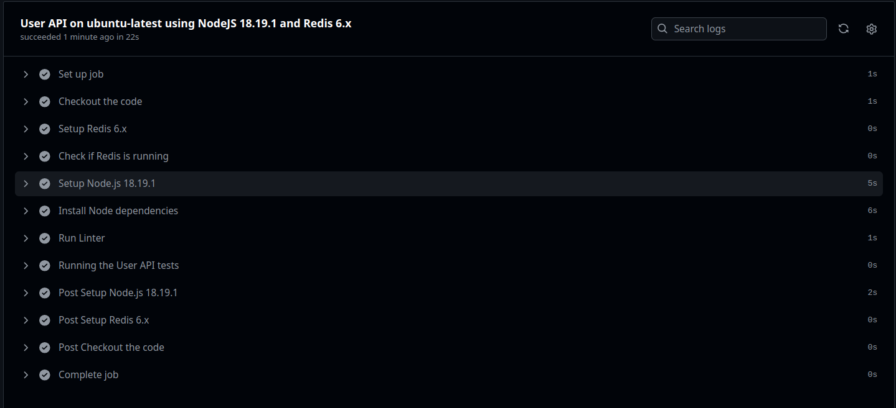
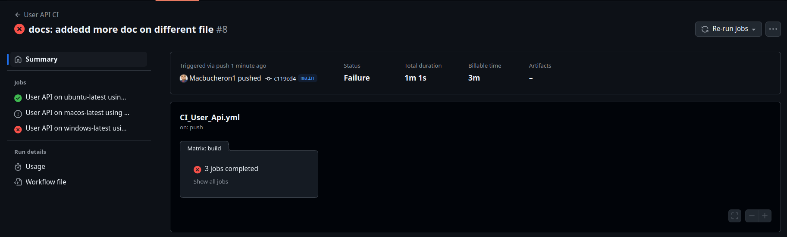

# ECE Devops Lab

## Table des matières

- [Description](#description)
- [Prerequisites](#prerequisites)
- [Install](#install)

## Description

This is the repository for the Devops project at ECE Paris

Made by:

- Nathan DEPRAT [@Macbucheron1](https://github.com/Macbucheron1)
- Ibrahim Diallo [@Xeroxx75](https://github.com/Xeroxx75)

## Install

Follow those step to install the project localy:

1. Clone the repository:

   ```bash
   git clone https://github.com/Macbucheron1/EceDevops_lab1.git
   ```

2. Access the project file :

   ```bash
   cd nom-du-projet
   ```

3. Install dependencies :

   - With **npm** :

     ```bash
     npm install
     ```

If you correctly followed all of the step you are now ready to use the project.

## Usage

To start the project you can use the following command:

```bash
npm start
```

It will start a web server available in your browser at http://localhost:3000.
To get an complete list of the possibility of the project you can check the [User API folder](./user_api/README.md)

## 1. Create a Web Application

Find all of the information in the [User API folder](./user_api/README.md). A link to come back to this page is available at the end of the file.

## 2. Apply CI/CD pipeline

### CI

The first CI pipeline we have made is using Github Actions. It is triggered on every push on the main branch. It run the following steps:

1. Check the code
2. Setup Redis
3. Check if Redis is running
4. Setup Node.js
5. Install dependencies
6. Run the tests for the User API

Here is the result of a successful run:



One of the feature of Github Actions is that it can run on multiple OS. Here is the result of a run on Windows:



The third job is failing because the Redis server is not available on Windows.
The second one as being stopped because of the error in the third job to economize resources.

## 3. Configuring and provisioning a virtual environment and run our application using the IaC approach

## 4. Building Docker image of our application

## 5. Making container orchestration using Docker Compose

## 6. Making docker orchestration using Kubernetes

## 7. Making a service mesh using Istio

## 8. Implementing Monitoring to our containerized application
