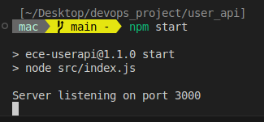
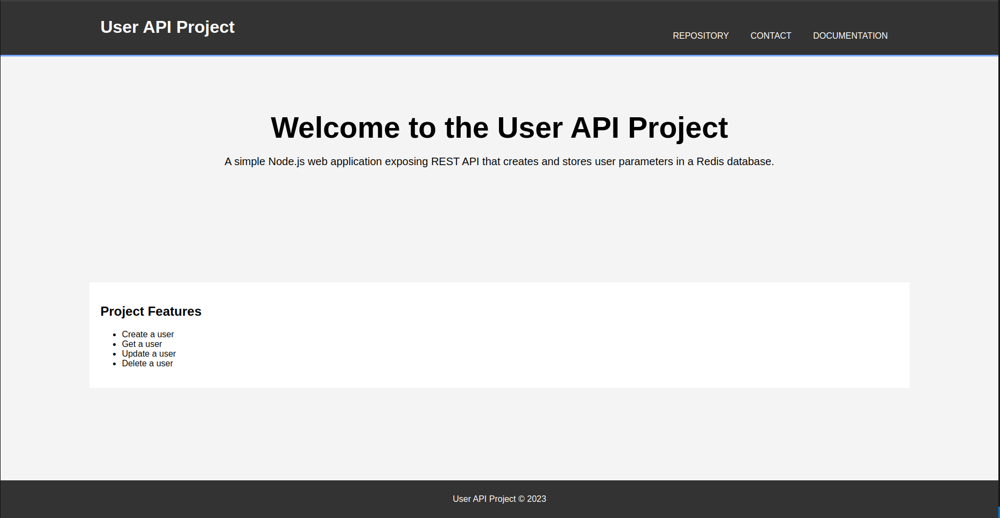

# User API web application

It is a basic [NodeJS](https://nodejs.org/en) web application exposing REST API that creates and stores user parameters in [Redis database](https://redis.io/).

## Functionality

1. Start a basic web server
2. Create a user
3. Get a user
4. Update a user
5. Delete a user

## Prerequisites

Before trying to install the project make sur to install those technologie:

- **[Node.js](https://nodejs.org/en/download/package-manager)** (v18.19.1 +)
- **[Redis](https://redis.io/docs/latest/operate/oss_and_stack/install/install-redis/)** (v7.4.1 +)

## Installation

Follow those step to install the project localy:

1. Clone the repository:

   ```bash
   git clone https://github.com/Macbucheron1/EceDevops_lab1.git
   ```

2. Access the project file :

   ```bash
   cd devops_project/user_api
   ```

3. Install dependencies :

   - With _**npm**_ :

     ```bash
     npm install
     ```

## Usage

> [!IMPORTANT]
> Make sur that **Redis** is running before starting the project. To make sure Redis is running use the command `redis-cli PING` and Redis should answer with `PONG`. If not, start Redis with the command `redis-server`.

Make sur you are in the `user_api` directory before running the following command.

**1. Start a web server**

From the root directory of the project run:

```bash
npm start
```


It will start a web server available in your browser at http://localhost:3000.




**2. Create a user**

Send a _POST_ (REST protocol) request using terminal:

```bash
curl --header "Content-Type: application/json" \
  --request POST \
  --data '{"username":"macbucheron","firstname":"Nathan","lastname":"Deprat"}' \
  http://localhost:3000/user
```

It will output:

```json
{ "status": "success", "msg": "OK" }
```

**3. Get a user**

Send a _GET_ (REST protocol) request using terminal

```bash
curl --header "Content-Type: application/json" \
  --request GET \
  http://localhost:3000/user/macbucheron
```

It will output:

```json
{ "status": "success", "msg": { "firstname": "Nathan", "lastname": "Deprat" } }
```

**4. Update a user**

Send a _PUT_ (REST protocol) request using terminal

```bash
curl --header "Content-Type: application/json" \
  --request PUT \
  --data '{"username": "macbucheron", "firstname":"Ibrahim", "lastname":"Diallo"}' \
  http://localhost:3000/user/update
```

It will output:

```json
{ "status": "success", "msg": "OK" }
```

**5. Delete a user**

Send a _DELETE_ (REST protocol) request using terminal

```bash
curl --header "Content-Type: application/json" \
  --request DELETE \
  http://localhost:3000/user/macbucheron
```

It will output:

```json
{ "status": "success", "msg": "Number of rows deleted: 1" }
```

**6. Health check**

Send a _GET_ (REST protocol) request using terminal

```bash
curl --header "Content-Type: application/json" \
  --request GET \
  http://localhost:3000/health
```

It will output:

```json
{ "uptime": 103.347303221, "status": "OK", "timestamp": 1732315440692 }
```

## API documentation

We have create an Api documentation using swagger. You can access it by going to the following link: [API documentation](http://localhost:3000/api-docs/)

## Testing

From the root directory of the project, run:

```bash
npm test
```

it will run the test suite and output the result :

```bash
$ npm test

> ece-userapi@1.1.0 test
> ./node_modules/.bin/mocha test/*.js

Server listening on port 3000


  Configure
    ✔ load default json configuration file
    ✔ load custom configuration

  Redis
    ✔ should connect to Redis

  User
    Create
      ✔ create a new user
      ✔ passing wrong user parameters (no username)
      ✔ passing wrong user parameters (no firstname)
      ✔ passing wrong user parameters (no lastname)
      ✔ avoid creating an existing user
    Get
      ✔ get a user by username
      ✔ can not get a user when it does not exist
      ✔ passing wrong username
    Update
      ✔ update an existing user
      ✔ passing wrong user parameters for update (no username
      ✔ passing wrong user parameters for update (no firstname)
      ✔ passing wrong user parameters for update (no lastname)
      ✔ can not update a user when it does not exist
    Delete
      ✔ deleting an existing user
      ✔ can not delete a non existing user
      ✔ passing no username for delete

  User REST API
    POST /user
      ✔ create a new user
      ✔ pass wrong parameters (no username)
      ✔ pass wrong parameters (no firstname)
      ✔ pass wrong parameters (no lastname)
      ✔ can not create a user with an existing username
    GET /user
      ✔ get an existing user
      ✔ can not get a user when it does not exist
    PUT /user
      ✔ update an existing user
      ✔ pass wrong parameters (no username)
      ✔ pass wrong parameters (no firstname)
      ✔ pass wrong parameters (no lastname)
      ✔ can not update a user when it does not exist
    DELETE /user
      ✔ delete an existing user
      ✔ can not delete a user when it does not exist


  33 passing (107ms)
```
