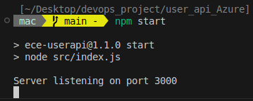
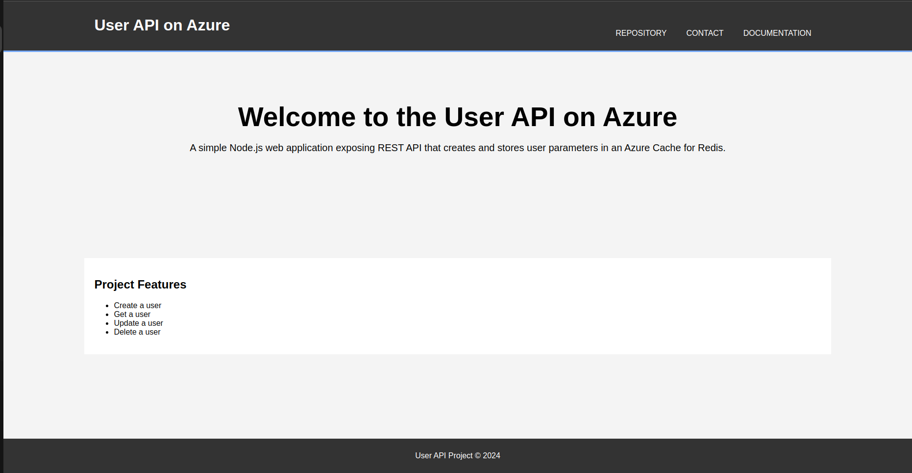
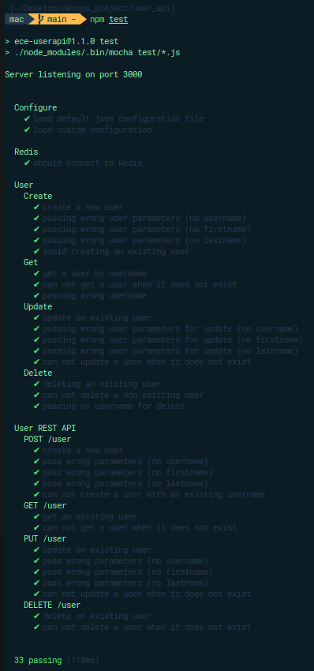

# User API on Azure

It is a basic [NodeJS](https://nodejs.org/en) web application exposing REST API that creates and stores user parameters in [Redis database](https://redis.io/).

## Functionality

1. Start a basic web server
2. Create a user
3. Get a user
4. Update a user
5. Delete a user

## Prerequisites

Before trying to install the project make sur to install those technologie:

- **[Node.js](https://nodejs.org/en/download/package-manager)** (v18.19.1 +)

## Installation

Follow those step to install the project localy:

1. Clone the repository:

   ```bash
   git clone https://github.com/Macbucheron1/EceDevops_lab1.git
   ```

2. Access the project file :

   ```bash
   cd Devops-Template/user_api
   ```

3. Install dependencies :

   - With _**npm**_ :

     ```bash
     npm install
     ```

## Usage

> [!IMPORTANT]
> In order to make to reproduce this project locally you will need to create an [Azure Cache for Redis](https://learn.microsoft.com/en-us/azure/azure-cache-for-redis/cache-nodejs-get-started?tabs=entraid&pivots=azure-cache-redis). Add your variables in a `.env` file at the root of the project (same level as _node_modules_).
> ```bash
> REDIS_HOST=your_redis_host
> REDIS_PORT=your_redis_port
> REDIS_PASSWORD=your_redis_password
> ```

Make sur you are in the `user_api_Azure` directory before running the following command.

### 1. Start a web server

From the root directory of the project run:

```bash
npm start
```



It will start a web server available in your browser at http://localhost:3000.



> [!CAUTION] 
> Sometimes you can get error when testing the API because of some process running on the port 3000. If you get an error, you can run the following command to kill the process: `kill -9 $(lsof -ti:3000)`

### 2. Create a user

Send a _POST_ (REST protocol) request using terminal:

```bash
curl --header "Content-Type: application/json" \
  --request POST \
  --data '{"username":"macbucheron","firstname":"Nathan","lastname":"Deprat"}' \
  http://localhost:3000/user
```

It will output:

```json
{ "status": "success", "msg": "OK" }
```

### 3. Get a user

Send a _GET_ (REST protocol) request using terminal

```bash
curl --header "Content-Type: application/json" \
  --request GET \
  http://localhost:3000/user/macbucheron
```

It will output:

```json
{ "status": "success", "msg": { "firstname": "Nathan", "lastname": "Deprat" } }
```

### 4. Update a user

Send a _PUT_ (REST protocol) request using terminal

```bash
curl --header "Content-Type: application/json" \
  --request PUT \
  --data '{"username": "macbucheron", "firstname":"Ibrahim", "lastname":"Diallo"}' \
  http://localhost:3000/user/update
```

It will output:

```json
{ "status": "success", "msg": "OK" }
```

### 5. Delete a user

Send a _DELETE_ (REST protocol) request using terminal

```bash
curl --header "Content-Type: application/json" \
  --request DELETE \
  http://localhost:3000/user/macbucheron
```

It will output:

```json
{ "status": "success", "msg": "Number of rows deleted: 1" }
```

### 6. Health check 

Send a _GET_ (REST protocol) request using terminal

```bash
curl --header "Content-Type: application/json" \
  --request GET \
  http://localhost:3000/health
```

It will output:

```json
{ "uptime": 103.347303221, "status": "OK", "timestamp": 1732315440692 }
```

## API documentation

We have created an Api documentation using [Swagger](https://swagger.io/). You can access it by going to the following link: [API documentation](http://localhost:3000/api-docs/)

## Testing

From the root directory of the project, run:

```bash
npm test
```

it will run the test suite and output the result :



## [Back to main README](../README.md#1-create-a-web-application)

Let's go back to the main [README](../README.md#2-apply-cicd-pipeline) to continue the project's walkthrough.